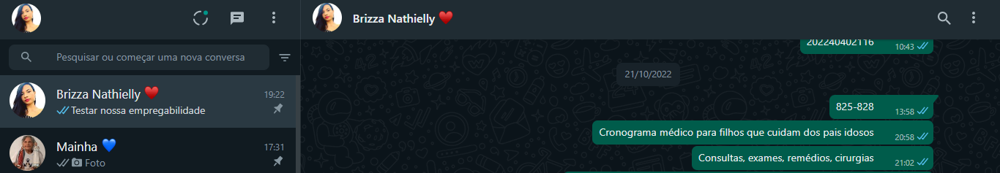
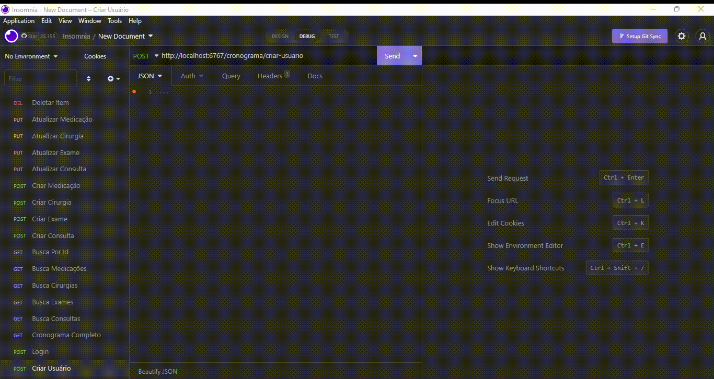
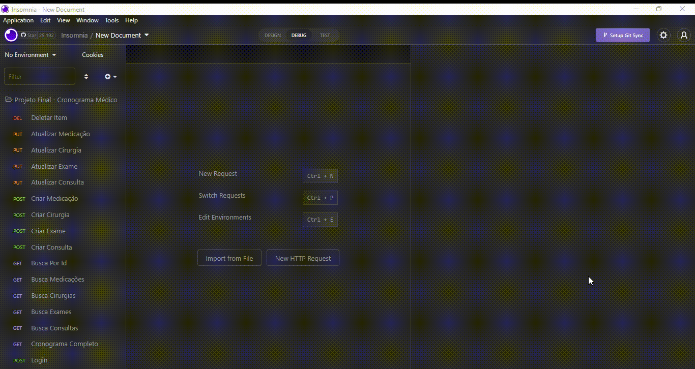

<h1 align="center">
    <br>
    <p align="center">Cronograma Médico para Filhos que Cuidam dos Pais Idosos<p>
</h1.>

<p align="center">
</p>
<br>


<p align="justify"> Bem vindx, ao meu projeto! Ele foi desenvolvido como requisito final para a conclusão do Bootcamp "Todas em Tech" da {reprograma}. 

## 📝 Link Apresentação

- [Apresentação](https://www.canva.com/design/DAFHkuR6_2A/xWI4AeidDDWksdBlniyc2w/view?utm_content=DAFHkuR6_2A&utm_campaign=designshare&utm_medium=link&utm_source=publishsharelink)

---

# Autora: Brizza Nathielly

# Turma: ON18 – Todas em Tech


# 📚JUSTIFICATIVA:

<p align="justify">
Minha vivência com minha mãe, que tem 67 anos e está com alguns problemas de saúde, fez com que eu percebesse que agora é a minha vez de cuidar dela! A necessidade de melhor organizar datas e horários de suas consultas médicas, exames, cirurgias e medicações se fez urgente.
<p align="justify">
Mesmo tendo nossa rede de apoio, família e amigos, sendo filha única, sou eu que tomo à frente e resolvo as coisas para ela. 
Assim, minha inspiração para este projeto veio através da minha vontade de prestar uma melhor assistência a minha mãe.
<p align="justify">
Tive a ideia no dia 21/10/2022, e até registrei no whatsapp, numa conversa comigo mesma:

<p align="center">
</p>
<br>

## 🔎 SOBRE A API:

<p align="justify">
O projeto "Cronograma Médico" é voltado para pessoas que cuidam dos pais idosos organizarem, em um só lugar, todas as consultas, exames, cirurgias e medicações para prestar uma melhor assistência aos seus pais. 

## ⚙️ FUNCIONALIDADES:

- Cadastro e Login de usuário;
- Listar todos os agendamentos da API pelo CPF do paciente escolhido;
- Listar todas os Consultas da API;
- Listar todos os Exames da API;
- Listar todas os Cirurgias da API;
- Listar todas os Medicações da API;
- Pesquisar um agendamento específico por Id;
- Cadastrar nova Consulta na API;
- Cadastrar novo Exame na API;
- Cadastrar nova Cirurgia na API;
- Cadastrar nova Medicação na API;
- Atualizar Consulta na API;
- Atualizar Exame na API;
- Atualizar Cirurgia na API;
- Atualizar Medicação na API;
- Deletar um agendamento específico por Id.

## 💻 MÉTODOS:
<p align="justify">
Desenvolvida utilizando JavaScript e Node.js, a API conta com quatro CRUDs completos que respeitam princípios de Clean Code. Utilizando a conexão com bando de dados MongoDB e as rotas foram testadas no Insomnia.

## 📂 ARQUITETURA MVC
```
 📁CRONOGRAMA MEDICO
   |
   |-  📁 assets
   |-  📁 src
   |    |
   |    |- 📁 config
   |         |- 📑 database.js
   |
   |    |- 📁 controllers
   |         |- 📑 authController.js
   |         |- 📑 cronogramaController.js
   |
   |    |- 📁 middlewares
   |         |- 📑 auth.js
   |
   |    |- 📁 models
   |         |- 📑CirurgiaSchema.js
   |         |- 📑ConsultaSchema.js
   |         |- 📑ExameSchema.js
   |         |- 📑MedicacaoSchema.js
   |         |- 📑UserSchema.js
   |
   |    |- 📁 routes
   |         |- 📑cronogramaRoutes.js
   |
   |
   |    |- 📑 app.js
   |
   |
   |- 📑 .env
   |- 📑 .env.example
   |- 📑 .gitignore
   |- 📑 package.json
   |- 📑 package-lock.json
   |- 📑 README.me
   |- 📑 server.js
   |- 📑 vercel.json
     
```

## 👨‍💻 TECNOLOGIAS E PACOTES UTILIZADOS:


**TECNOLOGIAS**

- [Git/GitHub](https://github.com/)
- [Vercel](https://vercel.com/)
- [JavaScript](https://www.javascript.com/)
- [MongoDB Atlas](https://www.mongodb.com/cloud/atlas)
- [Node.js](https://nodejs.org/en/)
- [Insomnia](https://insomnia.rest/download)
- [VScode](https://code.visualstudio.com/)  

### PACOTES


- [Cors](https://www.npmjs.com/package/cors)
- [Dotenv](https://www.npmjs.com/package/dotenv)
- [Express](https://expressjs.com/pt-br/)
- [Mongoose](https://mongoosejs.com/)
- [Nodemon](https://www.npmjs.com/package/nodemon)
- [Bcrypt](https://www.npmjs.com/package/bcrypt)
- [Jsonwebtoken](https://www.npmjs.com/package/jsonwebtoken)


# 🔃 ROTAS

| Método HTTP  | Endpoint              | Descrição                                  |
| ------------ | --------------------- | ------------------------------------------ |
| POST         | `/cronograma/criar-usuario`          | Cadastra novo usuário             |
| POST         | `/cronograma/login`                  | Usuário faz login no cronograma   |
| GET          | `/cronograma/completo/:cpf_do_paciente`| Lista todos os agendamentos do cronograma pelo CPF do paciente escolhido|
| GET          | `/cronograma/consultas`              | Lista todas as consultas do cronograma   |
| GET          | `/cronograma/exames`                 | Lista todos os exames do cronograma      |
| GET          | `/cronograma/cirurgias`              | Lista todas as cirurgias do cronograma   |
| GET          | `/cronograma/medicacoes`             | Lista todas as medicações do cronograma  |
| GET          | `/cronograma/buscar-por-id/:id`      | Filtra um agendamento específico por Id  |
| POST         | `/cronograma/criar-consulta`         | Cadastra nova Consulta                   |
| POST         | `/cronograma/criar-exame`            | Cadastra novo Exame                      |
| POST         | `/cronograma/criar-cirurgia`         | Cadastra nova Cirurgia                   |
| POST         | `/cronograma/criar-medicacao`        | Cadastra nova Medicação                  |
| PUT          | `/cronograma/atualizar-consulta/:id` | Atualiza Consulta específica por Id com autenticação   |
| PUT          | `/cronograma/atualizar-exame/:id`    | Atualiza Exame específico por Id com autenticação      |
| PUT          | `/cronograma/atualizar-cirurgia/:id` | Atualiza Cirurgia específica por Id com autenticação   |
| PUT          | `/cronograma/atualizar-medicacao/:id`| Atualiza Medicação específica por Id com autenticação  |
| DELETE       | `/cronograma/deletar-item/:id`       | Deleta um agendamento específico por Id com autenticação|

## 🛑​ PARA REALIZAR A INSTALAÇÃO NO SEU COMPUTADOR:


1. Primeiro é necessário clonar o seguinte repositório:

    ```bash
    $ git clone https://github.com/whoisbrizza/cronograma-medico-brizza-nathielly
     ```

2. Entre na seguinte pasta: 

    ```bash
    $ cd CRONOGRAMA-MEDICO-BRIZZA-NATHIELLY/
    ```
    
3. Para prosseguir, é necessário baixas as dependências: 

   ```bash
    $ npm install
    ```
4. Inicie o projeto com o comando: 

   ```bash
    $ npm start
    ```   

<br>

---


# ✔️VISUALIZAÇÃO E FUNCIONAMENTO:


<br>

>Criando um usuário:

<div align = "center">


</div>
<br>

<br>

>Usuário efetuando login:

<div align = "center">


</div>
<br>

<br>

>Criando Consultas:

<div align = "center">


</div>
<br>

<br>

>Criando Exames:

<div align = "center">


</div>
<br>


<br>

>Criando Cirurgias:

<div align = "center">


</div>
<br>
<br>

>Criando Medicações:

<div align = "center">


</div>
<br>
<br>

>Listando todos os agendamentos do Cronograma pelo CPF do paciente escolhido:

<div align = "center">


</div>
<br>
<br>

>Listando todas as consultas do cronograma:

<div align = "center">


</div>
<br>
<br>

>Listando todos os exames do cronograma:

<div align = "center">


</div>
<br>
<br>

>Listando todas as cirurgias do cronograma:

<div align = "center">


</div>
<br>
<br>

>Listando todas as medicações do cronograma:

<div align = "center">


</div>
<br>
<br>

>Filtrando um agendamento específico por Id:

<div align = "center">


</div>
<br>
<br>

>Atualizando Consulta específica por Id com autenticação:

<div align = "center">


</div>
<br>
<br>

>Atualizando Exame específico por Id com autenticação:

<div align = "center">


</div>
<br>

>Atualizando Cirurgia específica por Id com autenticação:

<div align = "center">


</div>
<br>
<br>

>Atualizando Medicação específica por Id com autenticação:

<div align = "center">


</div>
<br>
<br>

>Deletando um agendamento específico por Id com autenticação:

<div align = "center">


</div>
<br>


## 🏗️ IMPLEMENTAÇÕES FUTURAS:

*  Desenvolver um front-end;
*  Adaptar a API para um formato de APP;
*  Transformar esse cronograma numa rede social para que pessoas que cuidam de seus pais idosos possam interagir, compartilhar experiências, dicas e avaliações de clínicas, hospitais, farmácias, etc.


##  👩 SOBRE A AUTORA:


|Autora|Vivência|
|:------:|----|
|  | <p align="justify"> Me chamo Brizza Nathielly, mulher nordestina de Sergipe, filha única de mãe idosa, advogada e desenvolvedora Back-end. Minha vivência com minha mãe, que tem 67 anos e está com alguns problemas de saúde, fez com que eu percebesse que agora é a minha vez de cuidar dela! Minha vontade de prestar uma melhor assistência a minha mãe veio com a necessidade de melhor organizar datas e horários de suas consultas médicas, exames, cirurgias e medicações. Através do Bootcamp Todas Em Tech da {reprograma} tive meu primeiro contato com a programação. Foi uma jornada desafiadora, incrível e recompensadora. Serei eternamente grata! |

##  ✨ CONTATO:

<div>
<a href="https://instagram.com/whoisbrizza" target="_blank"></a>
<a href = "mailto:brizza.adv@hotmail.com"></a>
<a href="https://www.linkedin.com/in/brizzanathielly/" target="_blank"></a>   
</div>
