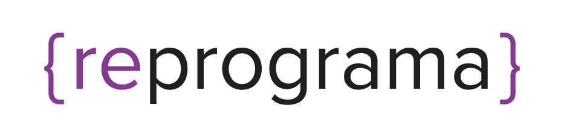

<h1 align="center">
  
</h1>

# Projeto Final da {reprograma}:

Projeto final do Bootcamp Todas em Tech, com o objetivo de reunir os conceitos estudados durante o curso de back-end e desafiar as alunas a colocar os seus conhecimentos em prática.

# Autora: Brizza Nathielly

# Turma: ON18 – Todas em Tech

# Nome do Projeto Final:

# Cronograma Médico para Filhos que Cuidam dos Pais Idosos

# Tema:

Aplicativo para filhos que cuidam dos pais idosos organizarem, em um só cronograma, todas as consultas, exames, cirurgias e medicações para prestar uma melhor assistência aos seus pais.

# Inspiração:

Minha inspiração para este projeto veio através da minha vivência com minha mãe, que já é idosa, e está com alguns problemas de saúde, tendo que fazer vários exames e até cirurgias! 

Eu que organizo tudo, os documentos, as datas, os horários.

Tive a ideia no dia 21/10/2022, e até registrei no whatsapp, numa conversa comigo mesma:

<h1 align="center">
  
</h1>

# Para o futuro:

Pretendo transformar esse cronograma numa rede social para que pessoas que cuidam de seus pais idosos possam interagir, compartilhar experiências, dicas e avaliações de clínicas, hospitais, farmácias, etc.

# Rotas/EndPoints (17 no total):

# 1)	POST /criar-usuario
Rota que cria um novo usuário, adiciona ele ao cronograma e retorna o usuário criado.
HTTP 201 CREATED
# Formato para criar um usuário:
name: {
    type: String,
    required: true,
  },
  email: {
    type: String,
    required: true,
  },
  password: {
    type: String,
    required: true,
  }
# Exemplo:
{
	"name": "Brizza Nathielly",
	"email": "brizzanathielly@email.com",
	"password": "umasenha"
}

# 2)	POST /login
Rota que o usuário faz o login no cronograma, e retorna um token que será usado como autenticação em algumas rotas.
HTTP 200 OK
Exemplo: 
{
	"email": "brizzanathielly@email.com",
	"password": "umasenha"
}

# 3)	GET /completo/:cpf_do_paciente
Rota que retorna uma lista com todos os itens do cronograma pelo CPF do paciente escolhido.
HTTP 200 OK

# 4)	GET /consultas
Rota que retorna uma lista com todas as consultas do cronograma.
HTTP 200 OK

# 5)	GET /exames
Rota que retorna uma lista com todos os exames do cronograma.
HTTP 200 OK

# 6)	GET /cirurgias
Rota que retorna uma lista com todas as cirurgias do cronograma.
HTTP 200 OK

# 7)	GET /medicacoes
Rota que retorna uma lista com todas as medicações do cronograma.
HTTP 200 OK

# 8)	GET /buscar-por-id/:id
Rota que retorna os detalhes sobre algum item, baseado no seu id.
HTTP 200 OK

# 9)	POST /criar-consulta
Rota que recebe uma nova consulta, adiciona ela ao cronograma e retorna o item criado.
HTTP 201 CREATED

# Formato para criar uma consulta:
nome_do_paciente: {
      type: String,
      required: true,
    },
    idade_do_paciente: {
      type: Number,
      required: true,
    },
    cpf_do_paciente: {
      type: String,
      required: true,
    },
    consulta: {
      type: String,
      required: true,
    },
    local_da_consulta: {
      type: String,
      required: true,
    },
    data_da_consulta: {
      type: String,
      required: true,
    },
    horario_da_consulta: {
      type: String,
      required: true,
    },
    alguma_observacao: {
      type: String,
      required: false,
    }
# Exemplo:
{
	"nome_do_paciente": "Valdeci Santos",
	"idade_do_paciente": 67,
	"cpf_do_paciente": "12345678911",
	"consulta": "Gastro",
	"local_da_consulta": "Hospital São José",
	"data_da_consulta": "10/12/2022",
	"horario_da_consulta": "09h00",
	"alguma_observacao:": "Levar o resultado da endoscopia"
}

# 10)	POST /criar-exame
Rota que recebe um novo exame, adiciona ele ao cronograma e retorna o item criado.
HTTP 201 CREATED
# Formato para criar um exame:
nome_do_paciente: {
      type: String,
      required: true,
    },
    idade_do_paciente: {
      type: Number,
      required: true,
    },
    cpf_do_paciente: {
      type: String,
      required: true,
    },
    exame: {
      type: String,
      required: true,
    },
    preparo_do_exame: {
      type: String,
      required: false,
    },
    local_do_exame: {
      type: String,
      required: true,
    },
    data_do_exame: {
      type: String,
      required: true,
    },
    horario_do_exame: {
      type: String,
      required: true,
    },
    alguma_observacao: {
      type: String,
      required: false,
    }
# Exemplo:
{
	"nome_do_paciente": "Valdeci Santos",
	"idade_do_paciente": 67,
	"cpf_do_paciente": "12345678911",
	"exame": "Densiometria",
	"preparo_do_exame": "Não tem preparo",
	"local_do_exame": "Clínica Amise",
	"data_do_exame": "05/12/2022",
	"horario_do_exame": "10h00",
	"alguma_observacao": "Perguntar quando sairá o resultado"
}

# 11)	POST /criar-cirurgia
Rota que recebe uma nova cirurgia, adiciona ela ao cronograma e retorna o item criado.
HTTP 201 CREATED
# Formato para criar uma cirurgia:
nome_do_paciente: {
      type: String,
      required: true,
    },
    idade_do_paciente: {
      type: Number,
      required: true,
    },
    cpf_do_paciente: {
      type: String,
      required: true,
    },
    cirurgia: {
      type: String,
      required: true,
    },
    profissional_responsavel_pela_cirurgia: {
      type: String,
      required: true,
    },
    preparo_da_cirurgia: {
      type: String,
      required: false,
    },
    local_da_cirurgia: {
      type: String,
      required: true,
    },
    data_da_cirurgia: {
      type: String,
      required: true,
    },
    horario_da_cirurgia: {
      type: String,
      required: true,
    },
    alguma_observacao: {
      type: String,
      required: false,
    }

# Exemplo:
{
	"nome_do_paciente": "Valdeci Santos",
	"idade_do_paciente": 67,
	"cpf_do_paciente": "12345678911",
	"cirurgia": "Vitrectomia Olho Esquerdo",
	"profissional_responsavel_pela_cirurgia": "Thiago Chagas",
	"preparo_da_cirurgia": "Jejum",
	"local_da_cirurgia": "IOCM",
	"data_da_cirurgia": "19/12/2022",
	"horario_da_cirurgia": "14h30",
	"alguma_observacao": "Última cirurgia, graças à Deus!"
}

# 12)	POST /criar-medicacao
Rota que recebe uma nova medicação, adiciona ela ao cronograma e retorna o item criado.
HTTP 201 CREATED
# Formato para criar uma medicação:
nome_do_paciente: {
      type: String,
      required: true,
    },
    idade_do_paciente: {
      type: Number,
      required: true,
    },
    cpf_do_paciente: {
      type: String,
      required: true,
    },
    medicacao: {
      type: String,
      required: true,
    },
    precisa_de_receita: {
      type: Boolean,
      required: true,
    },
    precisa_comprar: {
      type: Boolean,
      required: true,
    },
    dosagem: {
      type: String,
      required: true,
    },
    horario_da_medicacao: {
      type: String,
      required: true,
    },
    alguma_observacao: {
      type: String,
      required: false,
    }
# Exemplo:
{
	"nome_do_paciente": "Valdeci Santos",
	"idade_do_paciente": 67,
	"cpf_do_paciente": "12345678911",
	"medicacao": "Lubrificante Ocular",
	"precisa_de_receita": false,
	"precisa_comprar": false,
	"dosagem": "1 gota, 3 vezes ao dia",
	"horario_da_medicacao": "08h00, 15h00 e antes de dormir",
	"alguma_observacao": "Tentar outra marca"
}

# 13)	PUT /atualizar-consulta/:id
Rota que atualiza a quantidade de um certo item no cronograma baseado no seu id e retorna o item atualizado.
Com autenticação.
HTTP 200 OK

# 14)	PUT /atualizar-exame/:id
Rota que atualiza a quantidade de um certo item no cronograma baseado no seu id e retorna o item atualizado.
Com autenticação.
HTTP 200 OK

# 15)	PUT /atualizar-cirurgia/:id
Rota que atualiza a quantidade de um certo item no cronograma baseado no seu id e retorna o item atualizado.
Com autenticação.
HTTP 200 OK

# 16)	PUT /atualizar-medicacao/:id
Rota que atualiza a quantidade de um certo item no cronograma baseado no seu id e retorna o item atualizado.
Com autenticação.
HTTP 200 OK

# 17)	DELETE /deletar-item/:id
Rota que deleta um item baseado em seu id.
Com autenticação.
HTTP 200 OK
